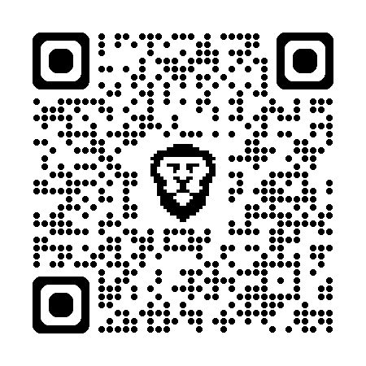

<div align="center">



## Barcode and QR Code Scanner

A powerful and intuitive Python-based barcode and QRCode scanning application that captures, processes, and stores barcode data with ease.
</div>

## Features

- **Real-time Barcode Detection**: Scan barcodes instantly using your webcam or camera
- **Multiple Format Support**: Handles various barcode formats (1D and 2D codes)
- **Data Persistence**: Scanned barcode data can be saved to JSON for easy access
- **Computer Vision Powered**: Leverages OpenCV for robust image processing
- **User-Friendly Interface**: Simple and intuitive application design
- **Efficient Processing**: Optimized for fast barcode recognition

## Quick Start

### Prerequisites

- Python 3.13.9 or higher
- [uv](https://docs.astral.sh/uv/#installation) package manager
- [ZBar bar code reader](https://zbar.sourceforge.net/download.html) 
- A camera/webcam connected to your system

### Installation

1. **Clone the repository**
   ```bash
   git clone https://github.com/Spike271/Barcode-Scanner.git
   cd barcode-scanner
   ```

2. **Install dependencies**
   ```bash
   uv sync
   ```
   
3. **Install ZBar bar code reader**
	### For Windows
	Install [Zbar](https://sourceforge.net/projects/zbar/) and the bin folder to the environmental variables. 

	### For Linux
	[Go here](https://stackoverflow.com/questions/34577710/cant-install-zbar)

### Usage

**Run the scanner:**
```bash
  uv run main.py
```


## Acknowledgements
   - `opencv-python` - Computer vision library for image processing
   - `pillow` - Image manipulation and processing
   - `numpy` - Numerical computing
